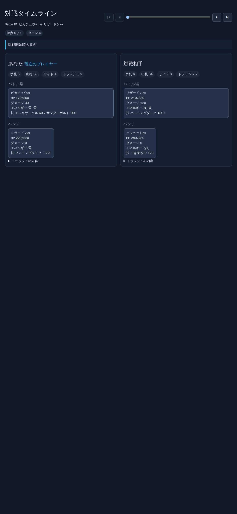
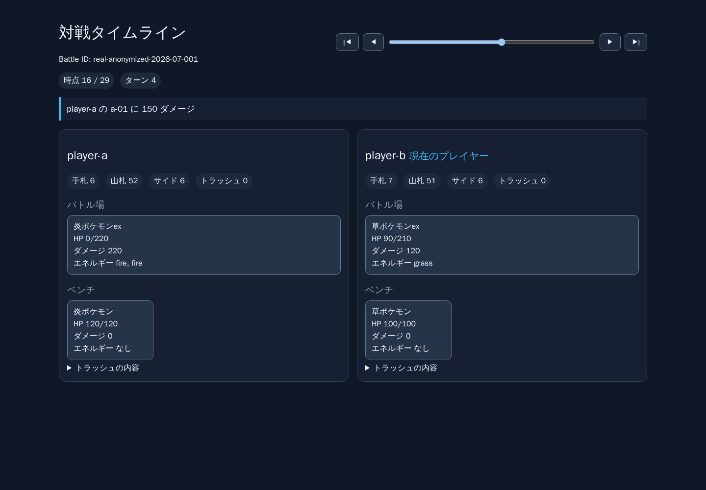

# 対戦タイムライン盤面ビューア

`ptcg-battle-log/v1` の対戦ログを、初期盤面から最終イベントまでブラウザで確認できます。
SOT-1906 で定義した `replayBattleLog` のスナップショットを表示に利用するため、入力検証や
イベント適用順序は再生契約と共通です。

## ローカルで起動する

リポジトリのルートで依存関係をインストールし、JSON ログを指定して起動します。

```bash
npm ci
npx tsx src/ptcg-battle-viewer-cli.ts src/__tests__/fixtures/battle-log.valid.json
```

表示された `http://127.0.0.1:4173` をブラウザで開いてください。別のポートを使う場合は
`--port 5173` のように指定できます。不正なログは起動時に再生契約の診断メッセージを表示して
終了します。

## iPhone のブラウザで表示する

PC と iPhone を同じ Wi-Fi/LAN に接続し、外部端末からの接続を許可して起動します。

```bash
npx tsx src/ptcg-battle-viewer-cli.ts \
  src/__tests__/fixtures/battle-log.real-anonymized.json \
  --host 0.0.0.0
```

起動時に `Same-network device: http://192.168.x.x:4173` のようなURLが表示されます。そのURLを
iPhone の Safari で開いてください。iPhone向けには、セーフエリア、44px以上の操作ボタン、
1列の盤面配置、横幅に収まるタイムラインを適用します。

接続できない場合は、PC側のファイアウォールで指定ポート（既定は4173）へのLAN内通信を許可し、
両端末が同じネットワークにいることを確認してください。`--host 0.0.0.0` はLAN内の他端末から
アクセス可能にするため、信頼できないネットワークでは使わず、確認後はプロセスを終了してください。
この手順はローカルネットワーク内での閲覧用であり、インターネットへの公開・常設配信は行いません。

## 操作と表示

- `|◀` / `▶|`: 初期盤面 / 最終時点へ移動
- `◀` / `▶`: 一つ前 / 次の時点へ移動（境界では無効）
- スライダー: 任意の時点へ直接移動

各時点ではターン、現在のプレイヤー、発生イベント、勝者、およびプレイヤーごとのバトル場、
ベンチ、手札枚数、山札枚数、サイド枚数、トラッシュを表示します。

## 表示例



この画像は `battle-log.snapshot.json` を表示したレビュー用盤面です。ピカチュウex、
リザードンexなどの具体的なポケモン名と、各カードの技・ダメージ・必要エネルギーを盤面上で確認できます。



この画像は匿名化した代表データ `battle-log.real-anonymized.json` を時点16まで再生した状態です。
タイムライン操作、発生イベント、現在のプレイヤー、および両プレイヤーのバトル場・ベンチ・
手札・山札・サイド・トラッシュを一画面で確認できます。

## 実対戦ログを観測する

`src/__tests__/fixtures/battle-log.real-anonymized.json` は、実戦のイベント列を
`ptcg-battle-log/v1` に変換し、プレイヤー名・カード名・対戦 ID を匿名化した代表 fixture
です。次のコマンドで対戦開始から勝者確定までを観測できます。

```bash
npx tsx src/ptcg-battle-viewer-cli.ts \
  src/__tests__/fixtures/battle-log.real-anonymized.json
```

ログを変換するときは、エンジンが記録した順序を保ち、秘匿情報を削除したうえで、契約が対応する
イベント名へ写像してください。変換後は次のコマンドで、全イベントが表示用スナップショットになる
ことを確認できます。

```bash
npm test -- --runInBand src/__tests__/ptcgBattleReplayIntegration.test.ts
```

## 対応範囲と既知の制約

- 対応イベントは `draw`, `play-active`, `play-bench`, `attach-energy`, `damage`, `knockout`,
  `take-prize`, `end-turn`, `declare-winner` です。特性、進化、入れ替え、状態異常などは未対応で、
  イベント番号を含む `unsupported event type` エラーとして明示されます。
- JSON の破損、スキーマ不一致、存在しないプレイヤー/カード、成立しない盤面遷移は、ビューア起動前に
  イベント番号付きの診断を表示して終了します。エラーを読み飛ばした部分再生は行いません。
- ブラウザには全時点の HTML を一括生成します。統合テストでは 500 イベントを1秒以内で再構成し、
  生成ページを 5 MB 未満に保つことを確認します。非常に大きいログは事前に分割してください。
- fixture は実戦由来ですが、個人情報、元の対戦 ID、実カード名を保持しません。新しい fixture も
  同じ匿名化方針に従ってください。
